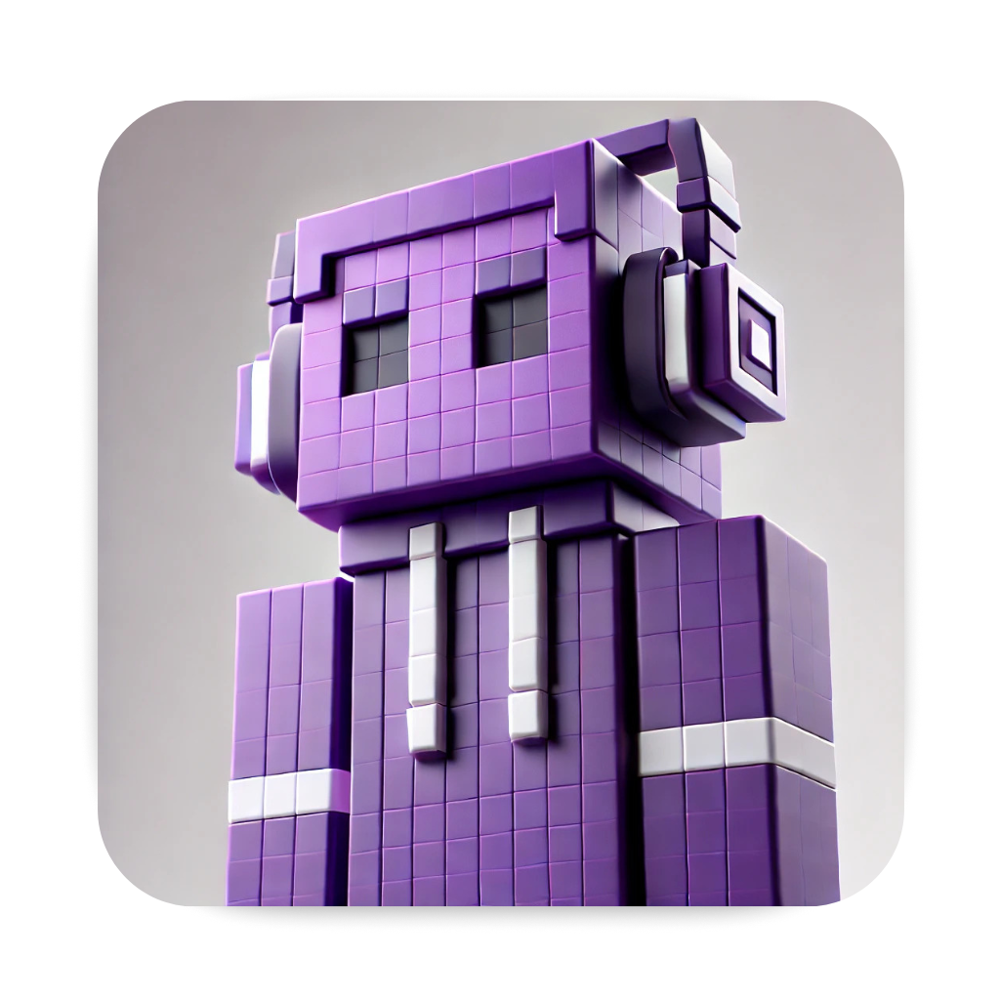
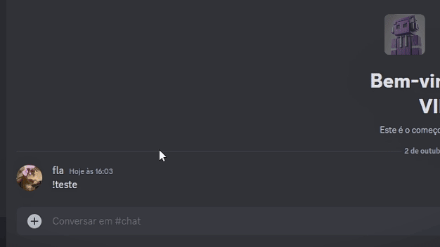

<p align="center">
  
</p>

<pre align="center">
__________.__              .__         .__       .__            
\______   \__|__  ___ ____ |  | _______|__| ____ |  |__   ____  
 |     ___/  \  \/  // __ \|  | \___   /  |/    \|  |  \ /  _ \ 
 |    |   |  |>    <\  ___/|  |__/    /|  |   |  \   Y  (  <_> )
 |____|   |__/__/\_ \\___  >____/_____ \__|___|  /___|  /\____/ 
                   \/    \/           \/       \/     \/        
</pre>

<p align="center">
  Bot de entretenimento para Discord que aumenta o engajamento em comunidades, com funcionalidades personalizáveis e código aberto!
</p>

<p align="center">
  <a href="https://github.com/flaveti/pixelzinho-bot-discord/releases">
    
  </a>
  <a href="https://github.com/flaveti/pixelzinho-bot-discord/issues">
    
  </a>
  <a href="https://discord.com/oauth2/authorize?client_id=1289360993905807533&permissions=277025745984&integration_type=0&scope=applications.commands+bot">
    
  </a>
</p>

</br>



</br>


### *Últimas Novidades 🔥*

- **2024/10**: Lançamento oficial do Pixelzinho no GitHub!
- **2024/11**: Planejamento de novas funcionalidades divertidas e interativas.
- **2024/12**: Início da comunidade de contribuidores para desenvolvimento colaborativo.

</br>


## 📋 Índice

- [Sobre o Projeto](#sobre-o-projeto)
- [Funcionalidades](#funcionalidades)
- [Instalação](#instalação)
- [Configuração](#configuração)
- [Uso](#uso)
- [Contribuição](#contribuição)
- [Licença](#licença)
- [Contato](#contato)


</br>


## 📖 Sobre o Projeto

O **Pixelzinho** é um bot de entretenimento para Discord, projetado para aumentar o engajamento em comunidades. Ele envia mensagens aleatórias, interage com os membros, reage a mensagens e muito mais! O código é aberto para que você possa personalizá-lo de acordo com as necessidades do seu negócio ou nicho.

Você pode adicionar o Pixelzinho ao seu servidor usando o link abaixo:

[**Adicionar o Pixelzinho ao seu servidor**](https://discord.com/oauth2/authorize?client_id=1289360993905807533&permissions=277025745984&integration_type=0&scope=applications.commands+bot)


</br>


## 🌟 Funcionalidades

- **Mensagens Aleatórias**: Envia mensagens divertidas e interativas em horários aleatórios.
- **Interações Personalizadas**: Responde a menções e interage com os usuários de forma personalizada.
- **Reações Automáticas**: Reage automaticamente a mensagens com emojis configurados.
- **Configuração Flexível**: Fácil de configurar através de comandos diretos no Discord.
- **Horários Personalizados**: Define horários de funcionamento para evitar interações fora do período desejado.
- **Código Aberto**: Personalize e expanda as funcionalidades de acordo com suas necessidades.

</br>


## 🚀 Instalação

### Pré-requisitos

- **Node.js** versão 16 ou superior.
- **NPM**  para gerenciar pacotes.
- **Conta no Discord Developer Portal** para criar um bot.

### Passo a Passo

1. **Clone o repositório**

   ```bash
   git clone https://github.com/seu-usuario/pixelzinho.git

2. **Navegue até o diretório do projeto**

   ```bash
   cd pixelzinho

3. **Instale as dependências**

   ```bash
   npm install
</br>

### Configuração do Bot

1. Insira o token do seu bot no campo discordBotToken dentro do config.json **("discordBotToken": "SEU_TOKEN_AQUI")**.

3. Insira o ID do seu bot no campo clientId dentro do registerCommands.js **const clientId = 'SEU_ID_AQUI'**.

2. Se você estiver usando comandos de barra (slash commands), registre-os executando:

```
   node registerCommands.js
   ```

4. Fique a vontade para alterar qualquer funcionalidade do bot ou as mensagens e respostas dentro de randomMessage.js.


</br>

# 🛠️ Configuração
O Pixelzinho utiliza um sistema de configuração interativo dentro do próprio Discord. Use o comando *!configbot* para iniciar o processo de configuração.

### Opções de Configuração

- **Canais:** Defina os canais para interações e logs.
- **Menções:** Configure a frequência das menções ao longo do dia.
- **Curtidas:** Personalize os emojis usados nas reações automáticas.

</br>

# 🎮 Uso

### Iniciar o Bot

Após a configuração, inicie o bot com:

```
   npm start
   ```


### Comandos Principais

> *!configbot:* Inicia o menu de configuração interativo.

> *!teste:* Envia uma mensagem de teste para verificar se o bot está funcionando corretamente.

### Interações

O bot enviará mensagens aleatórias mencionando membros do servidor.
Responderá a interações diretas e reagirá a mensagens com emojis configurados.

</br>

## 🤝 Contribuição
Contribuições são bem-vindas! Sinta-se à vontade para abrir issues e pull requests.

- Faça um fork do projeto.
- Crie uma branch para sua feature (git checkout -b feature/AmazingFeature).
- Commite suas mudanças (git commit -m 'Add some AmazingFeature').
- Faça o push para a branch (git push origin feature/AmazingFeature).
- Abra um Pull Request.

</br>

## 📄 Licença
Este projeto está sob a licença MIT - veja o arquivo [LICENSE](LICENSE) para mais detalhes.

</br>

## 📞 Contato
Flávia Machado - [LinkedIn](https://www.linkedin.com/in/flaviamkt/)</br>
Pliss Studio - [LinkedIn](https://www.linkedin.com/company/pliss-studio/) | [Instagram](https://www.instagram.com/pliss.studio) 

</br>

## 🙌 Agradecimentos
Agradeço a todos que contribuíram para este projeto e à comunidade que inspirou sua criação.

</br>

## 📝 Notas Adicionais
- Personalização: Você pode modificar as mensagens, emojis e funcionalidades diretamente nos arquivos de código para adaptar o bot ao seu nicho.
- Suporte: Caso tenha dúvidas ou encontre problemas, abra uma issue ou entre em contato diretamente.

</br>

## 🔗 Links Úteis
[Documentação do Discord.js](https://discord.js.org/docs/packages/discord.js/14.16.3)</br>
[Portal de Desenvolvedores do Discord](https://discord.com/developers)
